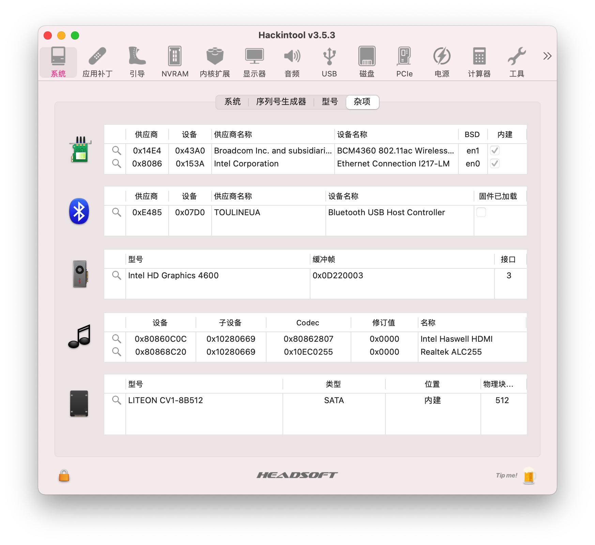
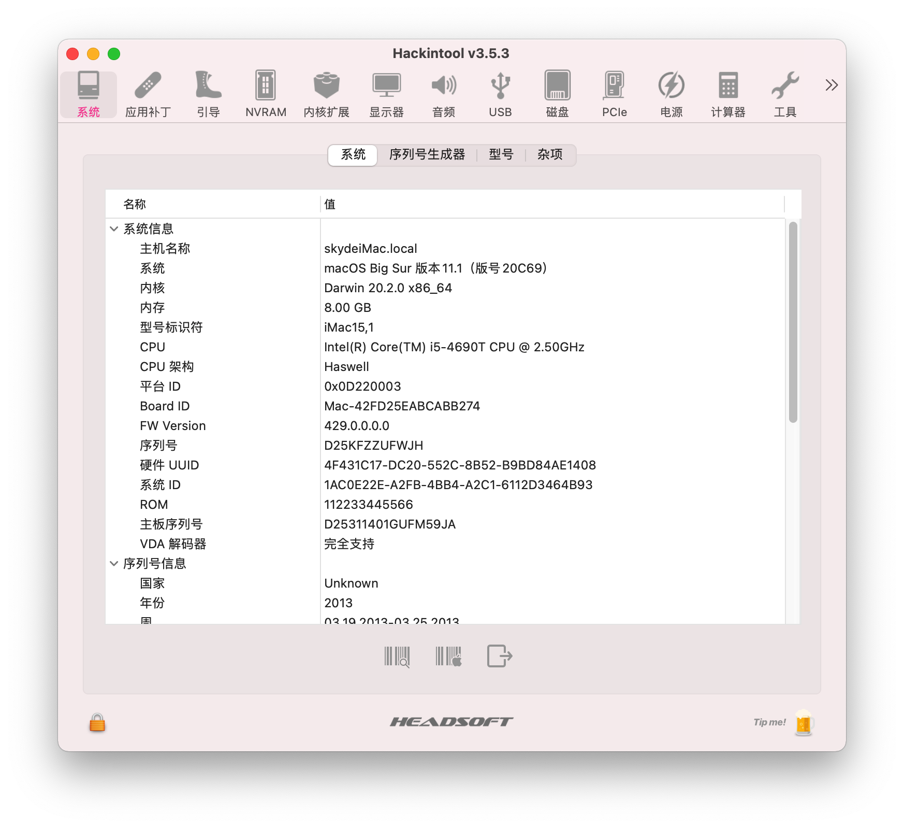

# Dell OptiPlex 9020m Hackintosh

## 电脑配置

|   规格   |                           详细信息                           |
| :------: | :----------------------------------------------------------: |
| 电脑型号 |                     Dell OptiPlex 9020m                      |
| 操作系统 |                        macOS Big Sur                         |
|  处理器  |                    英特尔 酷睿 i5 - 4690                     |
|   内存   |                         8 GB 1600MHz                         |
|  硬盘1   |                       LITEON CV1-8B512                       |
|  硬盘2   |                    可接SATA 2.5寸硬盘/SSD                    |
|   显卡   |                    Intel HD Graphics 4600                    |
|  显示器  |                          AOC U2790                           |
|   声卡   |                        Realtek ALC235                        |
|   网卡   | m.2 NGFF插槽，已更换为[BCM94360Z4](https://blog.daliansky.net/uploads/WeChatandShop.png) |

## 更新日志

- 1-28-2021
  
  - OpenCore `v0.6.6` 开发版
  - Release `v1.5.0`
  - 更新了新的[BCM94360Z4](https://blog.daliansky.net/uploads/WeChatandShop.png)驱动
  
  

### 设置`BIOS`

- 安全菜单：
  
  - 安全启动 -> `关闭`  (*Disable Secure Boot*)
  
- 高级菜单：
  
  - CPU菜单：`CFG Lock` -> `关闭` (*Disabling CFG Lock*)【相关BIOS请进群获取】
  
- 设备：
  - 显示设备
    - 预指派内存大小：`64MB` (*DVMT* pre-allocated memory)
  
  - ATA设备菜单：
    - `配置SATA为` -> `AHCI`
  
- 其它参数默认即可

  

## 备注：

关于更新`EFI`后第一次出现的卡在`SMCSuperIO`的问题

- 请执行重启或者`Reset NVRAM`的操作即可

## 截屏

## QQ交流群：

158976808 [DELL黑苹果交流群](https://qm.qq.com/cgi-bin/qm/qr?k=c9DeeyUg9x4dZlOpIVmj4R4g38p-YCZ1&jump_from=webapi) 1000人群 非专用机型请勿加入

## EFI下载

https://github.com/daliansky/Dell-OptiPlex-9020M-Hackintosh/releases/

